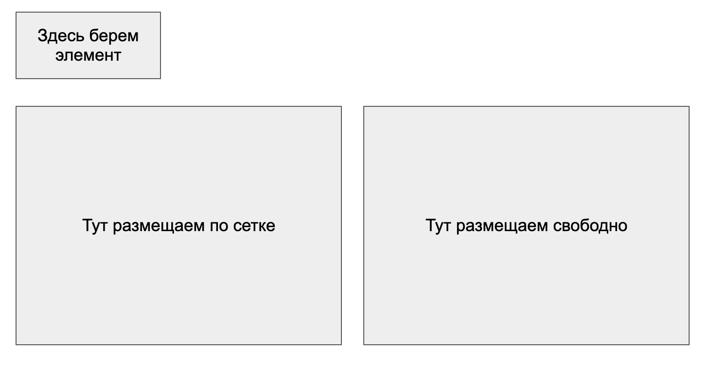

# Домашнее задание (AJAX и другие API браузера, часть II)

## Когда сдавать?
1) Soft-deadline - 28 января 2025
2) Hard-deadline - 4 февраля 2025

## Задача:
Реализовать drag’n’drop(перетаскивание) элементов с помощью курсора мыши, либо касанием пальца на тач-устройстве
* Зона создающая новый элемент при перетаскивании
* Элемент — квадрат 100х100px случайного цвета
* Область при перетаскивании в которую элементы располагаются в соответствии с сеткой
* Область сохраняющая положение перемещенного в неё элемента
* Если элемент опущен мимо вышеописанных областей — он исчезает

## Инструкция:
1) Сделать форк
2) Клонировать репозиторий на свой компьютер
3) Создать ветку solution от main
4) Установить [NodeJS](https://nodejs.org/en/), если его нет
5) Запустить `npm install` для установки зависимостей
6) Запустить локальный сервер - `npm run server`
7) Открыть страницу с приложением `http://localhost:5000/`
8) Редактируйте `index.html`, `index.js` и `styles.css` в папке `public` для выполнения задания.

